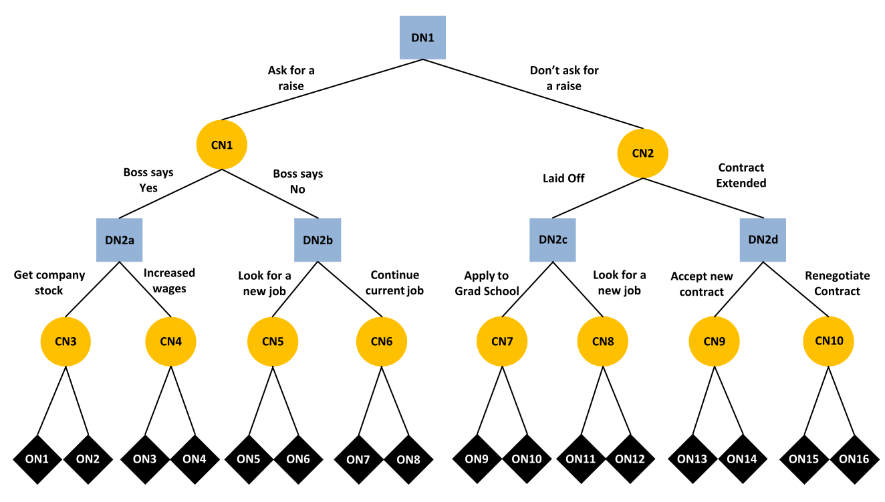

```@raw html

```
# Model Overview

The goal of this page is to describe a True and Error Model (TEM) of multistage decision making (see Deng, et al., 2026), designed to disentangle strategy use and errors. TEMs address a fundamental problem in decision making: responses reflect a mixture of true strategy use and various sources of error. Inferences about strategy use can be biased or misleading without taking into account errors. For example, a person may use backward induction when performing a multi-stage decision task, but inadverently selects the wrong response or encode information correctly, thus producing a random error. As the name implies, TEMs are designed to decompose response into true and error components.

# Multistage Decision Task

In the multi-stage decision making task, subjects make a sequence of two decisions as shown in the decision tree below taken from Deng et al., 2026. The decision tree consists of branches and three types of nodes:

1. decision nodes in blue
2. chance nodes in yellow
3. outcome nodes in black

The tree is traversed from the top node through a path that terminates at one of outcome nodes at the bottom. The path is determined by a combination of decisions and chance outcomes. 



Importantly, in Deng et al. 2026, the tree structure and outcomes are designed such that backward or forward induction strategies result in mutually exclusive and exhaustive choice patterns. Subjects completed the same multistage decision making task in four blocks, resulting in $2^4 - 1 = 15$ degrees of freedom for estimating model parameters. 

# True and Error Model of Multistage Decision Making

In this section, we will describe the TEM for the multi-stage decision making task used in Deng et al., (2026). To orient ourselves to the model, consider a hypothetical response vector $\mathbf{y} = [1,0,1,1]$, where elements are coded as follows:

-  $y_i = 1$: indicates a person's response pattern is consistent with backward induction in block $i$
-  $y_i = 0$: indicates a person's response pattern is consistent with forward induction in block $i$

A fundamental assumption of TEM is that responses patterns are error prone. It follows that each $y_i$ is a mixture of backward induction, forward induction, and error. The multi-stage TEM assumes a person is using a backward induction strategy with probability $b$ and a forward induction strategy with the complementary probability $1 - b$. In the simplest case, if a person is using a backward induction strategy, the probability of generating a set of responses in a given block consistent with backward induction is $(1 - \epsilon)$ and the probability of generating a set of responses in a given block consistent with forward induction is $\epsilon$. If a person is using forward induction, the response pattern is similar. 

```math
p([1,0,1,1]) = \underbrace{b \cdot (1 - \epsilon) \cdot \epsilon \cdot (1 - \epsilon) \cdot (1 - \epsilon)}_{\mathrm{backward}} + \underbrace{(1 - b) \cdot \epsilon \cdot (1 - \epsilon) \cdot \epsilon \cdot \epsilon}_{\mathrm{forward}} 
```

Weng et al. (2026) developed a more general model which allows the strategy to shift between blocks 2 and 3 and also allows the error to differ across blocks. In this more general model, $s_b$ represents the probability of sticking with backward induction and $s_f$ represents the probability of sticking with forward induction. This model is a mixture of four instead of two components:

```math
p([1,0,1,1]) = \underbrace{b \cdot (1 - \epsilon_{1}) \cdot \epsilon_{2} \cdot sb \cdot (1 - \epsilon_{3}) \cdot (1 - \epsilon_{4})}_{\mathrm{backward \rightarrow backward}} + \\
\underbrace{b \cdot (1 - \epsilon_{1}) \cdot \epsilon_{2} \cdot (1 - sb) \cdot \epsilon_{3} \cdot \epsilon_{4}}_{\mathrm{backward \rightarrow  forward}} + \\
\underbrace{(1 - b) \cdot \epsilon_{1} \cdot (1 - \epsilon_{2}) \cdot sf \cdot \epsilon_{3} \cdot \epsilon_{4}}_{\mathrm{forward \rightarrow forward}} + \\
\underbrace{(1 - b) \cdot \epsilon_{1} \cdot (1 - \epsilon_{2}) \cdot (1 - sf) \cdot (1 - \epsilon_{3}) \cdot (1 - \epsilon_{4})}_{\mathrm{forward \rightarrow backward}}
```

## Summary of Parameters

The full multi-stage TEM contains 7 parameters in total. 

- `b`: the probability of prefering the risky option in both choice sets
- `sb`: the probability of prefering the risky option in the first choice set and prefering the safe option in the second choice set
- `sf`: the probability of prefering the safe option in the first choice set and prefering the risky option in the second choice set

The remaining four parameters correspond to error probabilities:

- ``\epsilon_{1}``: the error probability in block 1.
- ``\epsilon_{2}``: the error probability in block 2.
- ``\epsilon_{3}``: the error probability in block 3.
- ``\epsilon_{4}``: the error probability in block 4.

Sub-models can be formed by imposing parameter constraints, e.g., $\epsilon_i = \epsilon$. 

# Model Equations

The multi-stage TEM consists of 16 equations, one for each response pattern. Each equation consists of four mixture components, which are shown on separate lines. In what follows, let $B$ denote a response that is consistent with backward induction and $F$ denote a response that is consistent with forward induction.

### $BBBB$
```math
\theta_{1} =
    b \cdot (1 - \epsilon_{1}) \cdot (1 - \epsilon_{2}) \cdot sb \cdot (1 - \epsilon_{3}) \cdot (1 - \epsilon_{4}) + \\
    b \cdot (1 - \epsilon_{1}) \cdot (1 - \epsilon_{2}) \cdot (1 - sb) \cdot \epsilon_{3} \cdot \epsilon_{4} + \\
    (1 - b) \cdot \epsilon_{1} \cdot \epsilon_{2} \cdot sf \cdot \epsilon_{3} \cdot \epsilon_{4} + \\
    (1 - b) \cdot \epsilon_{1} \cdot \epsilon_{2} \cdot (1 - sf) \cdot (1 - \epsilon_{3}) \cdot (1 - \epsilon_{4})
```

### $FBBB$
```math
\theta_{2} =
b \cdot \epsilon_{1} \cdot (1 - \epsilon_{2}) \cdot sb \cdot (1 - \epsilon_{3}) \cdot (1 - \epsilon_{4}) + \\
b \cdot \epsilon_{1} \cdot (1 - \epsilon_{2}) \cdot (1 - sb) \cdot \epsilon_{3} \cdot \epsilon_{4} + \\
(1 - b) \cdot (1 - \epsilon_{1}) \cdot \epsilon_{2} \cdot sf \cdot \epsilon_{3} \cdot \epsilon_{4} + \\
(1 - b) \cdot (1 - \epsilon_{1}) \cdot \epsilon_{2} \cdot (1 - sf) \cdot (1 - \epsilon_{3}) \cdot (1 - \epsilon_{4})
```
### $BFBB$
```math
\theta_{3} =
b \cdot (1 - \epsilon_{1}) \cdot \epsilon_{2} \cdot sb \cdot (1 - \epsilon_{3}) \cdot (1 - \epsilon_{4}) + \\
b \cdot (1 - \epsilon_{1}) \cdot \epsilon_{2} \cdot (1 - sb) \cdot \epsilon_{3} \cdot \epsilon_{4} + \\
(1 - b) \cdot \epsilon_{1} \cdot (1 - \epsilon_{2}) \cdot sf \cdot \epsilon_{3} \cdot \epsilon_{4} + \\
(1 - b) \cdot \epsilon_{1} \cdot (1 - \epsilon_{2}) \cdot (1 - sf) \cdot (1 - \epsilon_{3}) \cdot (1 - \epsilon_{4})
```
### $FFBB$
```math
\theta_{4} =
b \cdot \epsilon_{1} \cdot \epsilon_{2} \cdot sb \cdot (1 - \epsilon_{3}) \cdot (1 - \epsilon_{4}) + \\
b \cdot \epsilon_{1} \cdot \epsilon_{2} \cdot (1 - sb) \cdot \epsilon_{3} \cdot \epsilon_{4} + \\
(1 - b) \cdot (1 - \epsilon_{1}) \cdot (1 - \epsilon_{2}) \cdot sf \cdot \epsilon_{3} \cdot \epsilon_{4} + \\
(1 - b) \cdot (1 - \epsilon_{1}) \cdot (1 - \epsilon_{2}) \cdot (1 - sf) \cdot (1 - \epsilon_{3}) \cdot (1 - \epsilon_{4})
```
### $BBFB$
```math
\theta_{5} =
b \cdot (1 - \epsilon_{1}) \cdot (1 - \epsilon_{2}) \cdot sb \cdot \epsilon_{3} \cdot (1 - \epsilon_{4}) + \\
b \cdot (1 - \epsilon_{1}) \cdot (1 - \epsilon_{2}) \cdot (1 - sb) \cdot (1 - \epsilon_{3}) \cdot \epsilon_{4} + \\
(1 - b) \cdot \epsilon_{1} \cdot \epsilon_{2} \cdot sf \cdot (1 - \epsilon_{3}) \cdot \epsilon_{4} + \\
(1 - b) \cdot \epsilon_{1} \cdot \epsilon_{2} \cdot (1 - sf) \cdot \epsilon_{3} \cdot (1 - \epsilon_{4})
```
### $FBFB$
```math
\theta_{6} =
b \cdot \epsilon_{1} \cdot (1 - \epsilon_{2}) \cdot sb \cdot \epsilon_{3} \cdot (1 - \epsilon_{4}) + \\
b \cdot \epsilon_{1} \cdot (1 - \epsilon_{2}) \cdot (1 - sb) \cdot (1 - \epsilon_{3}) \cdot \epsilon_{4} + \\
(1 - b) \cdot (1 - \epsilon_{1}) \cdot \epsilon_{2} \cdot sf \cdot (1 - \epsilon_{3}) \cdot \epsilon_{4} + \\
(1 - b) \cdot (1 - \epsilon_{1}) \cdot \epsilon_{2} \cdot (1 - sf) \cdot \epsilon_{3} \cdot (1 - \epsilon_{4})
```
### $BFFB$
```math
\theta_{7} =
b \cdot (1 - \epsilon_{1}) \cdot \epsilon_{2} \cdot sb \cdot \epsilon_{3} \cdot (1 - \epsilon_{4}) + \\
b \cdot (1 - \epsilon_{1}) \cdot \epsilon_{2} \cdot (1 - sb) \cdot (1 - \epsilon_{3}) \cdot \epsilon_{4} + \\
(1 - b) \cdot \epsilon_{1} \cdot (1 - \epsilon_{2}) \cdot sf \cdot (1 - \epsilon_{3}) \cdot \epsilon_{4} + \\
(1 - b) \cdot \epsilon_{1} \cdot (1 - \epsilon_{2}) \cdot (1 - sf) \cdot \epsilon_{3} \cdot (1 - \epsilon_{4})
```
### $FFFB$
```math
\theta_{8} =
b \cdot \epsilon_{1} \cdot \epsilon_{2} \cdot sb \cdot \epsilon_{3} \cdot (1 - \epsilon_{4}) + \\
b \cdot \epsilon_{1} \cdot \epsilon_{2} \cdot (1 - sb) \cdot (1 - \epsilon_{3}) \cdot \epsilon_{4} + \\
(1 - b) \cdot (1 - \epsilon_{1}) \cdot (1 - \epsilon_{2}) \cdot sf \cdot (1 - \epsilon_{3}) \cdot \epsilon_{4} + \\
(1 - b) \cdot (1 - \epsilon_{1}) \cdot (1 - \epsilon_{2}) \cdot (1 - sf) \cdot \epsilon_{3} \cdot (1 - \epsilon_{4})
```
### $BBBF$
```math
\theta_{9} =
b \cdot (1 - \epsilon_{1}) \cdot (1 - \epsilon_{2}) \cdot sb \cdot (1 - \epsilon_{3}) \cdot \epsilon_{4} + \\
b \cdot (1 - \epsilon_{1}) \cdot (1 - \epsilon_{2}) \cdot (1 - sb) \cdot \epsilon_{3} \cdot (1 - \epsilon_{4}) + \\
(1 - b) \cdot \epsilon_{1} \cdot \epsilon_{2} \cdot sf \cdot \epsilon_{3} \cdot (1 - \epsilon_{4}) + \\
(1 - b) \cdot \epsilon_{1} \cdot \epsilon_{2} \cdot (1 - sf) \cdot (1 - \epsilon_{3}) \cdot \epsilon_{4}
```
### $FBBF$
```math
\theta_{10} =
b \cdot \epsilon_{1} \cdot (1 - \epsilon_{2}) \cdot sb \cdot (1 - \epsilon_{3}) \cdot \epsilon_{4} + \\
b \cdot \epsilon_{1} \cdot (1 - \epsilon_{2}) \cdot (1 - sb) \cdot \epsilon_{3} \cdot (1 - \epsilon_{4}) + \\
(1 - b) \cdot (1 - \epsilon_{1}) \cdot \epsilon_{2} \cdot sf \cdot \epsilon_{3} \cdot (1 - \epsilon_{4}) + \\
(1 - b) \cdot (1 - \epsilon_{1}) \cdot \epsilon_{2} \cdot (1 - sf) \cdot (1 - \epsilon_{3}) \cdot \epsilon_{4}
```
### $BFBF$
```math
\theta_{11} =
b \cdot (1 - \epsilon_{1}) \cdot \epsilon_{2} \cdot sb \cdot (1 - \epsilon_{3}) \cdot \epsilon_{4} + \\
b \cdot (1 - \epsilon_{1}) \cdot \epsilon_{2} \cdot (1 - sb) \cdot \epsilon_{3} \cdot (1 - \epsilon_{4}) + \\
(1 - b) \cdot \epsilon_{1} \cdot (1 - \epsilon_{2}) \cdot sf \cdot \epsilon_{3} \cdot (1 - \epsilon_{4}) + \\
(1 - b) \cdot \epsilon_{1} \cdot (1 - \epsilon_{2}) \cdot (1 - sf) \cdot (1 - \epsilon_{3}) \cdot \epsilon_{4}
```
### $FFBF$
```math
\theta_{12} =
b \cdot \epsilon_{1} \cdot \epsilon_{2} \cdot sb \cdot (1 - \epsilon_{3}) \cdot \epsilon_{4} + \\
b \cdot \epsilon_{1} \cdot \epsilon_{2} \cdot (1 - sb) \cdot \epsilon_{3} \cdot (1 - \epsilon_{4}) + \\
(1 - b) \cdot (1 - \epsilon_{1}) \cdot (1 - \epsilon_{2}) \cdot sf \cdot \epsilon_{3} \cdot (1 - \epsilon_{4}) + \\
(1 - b) \cdot (1 - \epsilon_{1}) \cdot (1 - \epsilon_{2}) \cdot (1 - sf) \cdot (1 - \epsilon_{3}) \cdot \epsilon_{4}
```
### $BBFF$
```math
\theta_{13} =
b \cdot (1 - \epsilon_{1}) \cdot (1 - \epsilon_{2}) \cdot sb \cdot \epsilon_{3} \cdot \epsilon_{4} + \\
b \cdot (1 - \epsilon_{1}) \cdot (1 - \epsilon_{2}) \cdot (1 - sb) \cdot (1 - \epsilon_{3}) \cdot (1 - \epsilon_{4}) + \\
(1 - b) \cdot \epsilon_{1} \cdot \epsilon_{2} \cdot sf \cdot (1 - \epsilon_{3}) \cdot (1 - \epsilon_{4}) + \\
(1 - b) \cdot \epsilon_{1} \cdot \epsilon_{2} \cdot (1 - sf) \cdot \epsilon_{3} \cdot \epsilon_{4}
```
### $FBFF$
```math
\theta_{14} =
b \cdot \epsilon_{1} \cdot (1 - \epsilon_{2}) \cdot sb \cdot \epsilon_{3} \cdot \epsilon_{4} + \\
b \cdot \epsilon_{1} \cdot (1 - \epsilon_{2}) \cdot (1 - sb) \cdot (1 - \epsilon_{3}) \cdot (1 - \epsilon_{4}) + \\
(1 - b) \cdot (1 - \epsilon_{1}) \cdot \epsilon_{2} \cdot sf \cdot (1 - \epsilon_{3}) \cdot (1 - \epsilon_{4}) + \\
(1 - b) \cdot (1 - \epsilon_{1}) \cdot \epsilon_{2} \cdot (1 - sf) \cdot \epsilon_{3} \cdot \epsilon_{4}
```
### $BFFF$
```math
\theta_{15} =
b \cdot (1 - \epsilon_{1}) \cdot \epsilon_{2} \cdot sb \cdot \epsilon_{3} \cdot \epsilon_{4} + \\
b \cdot (1 - \epsilon_{1}) \cdot \epsilon_{2} \cdot (1 - sb) \cdot (1 - \epsilon_{3}) \cdot (1 - \epsilon_{4}) + \\
(1 - b) \cdot \epsilon_{1} \cdot (1 - \epsilon_{2}) \cdot sf \cdot (1 - \epsilon_{3}) \cdot (1 - \epsilon_{4}) + \\
(1 - b) \cdot \epsilon_{1} \cdot (1 - \epsilon_{2}) \cdot (1 - sf) \cdot \epsilon_{3} \cdot \epsilon_{4}
```
### $FFFF$
```math
\theta_{16} =
b \cdot \epsilon_{1} \cdot \epsilon_{2} \cdot sb \cdot \epsilon_{3} \cdot \epsilon_{4} + \\
b \cdot \epsilon_{1} \cdot \epsilon_{2} \cdot (1 - sb) \cdot (1 - \epsilon_{3}) \cdot (1 - \epsilon_{4}) + \\
(1 - b) \cdot (1 - \epsilon_{1}) \cdot (1 - \epsilon_{2}) \cdot sf \cdot (1 - \epsilon_{3}) \cdot (1 - \epsilon_{4}) + \\
(1 - b) \cdot (1 - \epsilon_{1}) \cdot (1 - \epsilon_{2}) \cdot (1 - sf) \cdot \epsilon_{3} \cdot \epsilon_{4}
```
# References

Birnbaum, M. H., & Quispe-Torreblanca, E. G. (2018). TEMAP2. R: True and error model analysis program in R. Judgment and Decision Making, 13(5), 428-440.

Deng, W., Kellen, D., & Hotaling, J. M. (2026). Toward the cognitive modeling of dynamic decision making. Psychonomic Bulletin & Review, 33(4), 127.