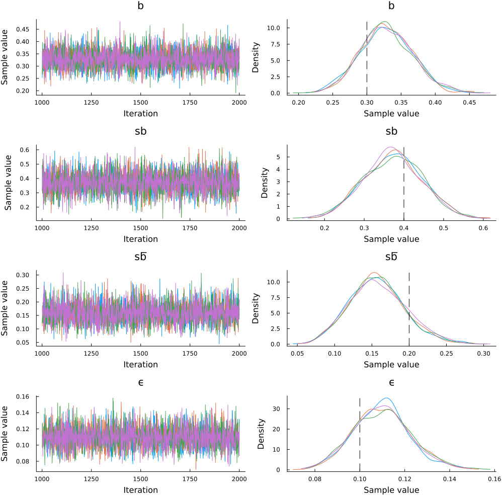

```@raw html

```
# Bayesian Parameter Estimation

The purpose of this tutorial is to demonstrate how to perform Bayesian parameter estimation of the True and Error model (TET; Birnbaum & Quispe-Torreblanca, 2018) using the [Turing.jl](https://turinglang.org/) package. 

## Full Code 

You can reveal copy-and-pastable version of the full code by clicking the ▶ below.

```@raw html
<details>
<summary><b>Show Full Code</b></summary>
```
```julia

using MultistageTrueAndErrorModels
using Random
using StatsPlots
using Turing
Random.seed!(685)

model = MultistageTrueErrorModel(;
    b = 0.3,
    sb = 0.4,
    sf = 0.2,
    ϵ = fill(0.1, 4)
)

data = rand(model, 200)

@model function model1(data::Vector{<:Integer})
    b ~ Uniform(0, 1)
    sb ~ Uniform(0, 1)
    sf ~ Uniform(0, 1)
    ϵ ~ Uniform(0, 0.5)
    ϵ′ = fill(ϵ, 4)

    data ~ MultistageTrueErrorModel(; b, sb, sf, ϵ = ϵ′)
    return (; b, sb, sf, ϵ = ϵ′)
end

chains = sample(model1(data), NUTS(1000, 0.65), MCMCThreads(), 1000, 4)

post_plot = plot(chains, grid = false)
vline!(
    post_plot,
    [missing 0.3 missing 0.4 missing 0.2 missing 0.10],
    color = :black,
    linestyle = :dash
)
```
```@raw html
</details>
```

## Load Packages

The first step is to load the required packages. You will need to install each package in your local
environment in order to run the code locally. We will also set a random number generator so that the results are reproducible.

```julia
using MultistageTrueAndErrorModels
using Random
using StatsPlots
using Turing
Random.seed!(685)
```

## Generate Data

For a description of the decision making task, please see the description in the [model overview](https://itsdfish.github.io/TrueAndErrorModels.jl/dev/overview/). In the code block below, we will create a model object and generate 2 simulated responses from 100 simulated subjects for a total of 200 responses. For this model, we assume that the probability of a true preference state RR is relatively high, and the probability of other preference states decreases as they become more difference from RR:

``
b = .30
``

``
sb = .40
``

``
sf= .20
``

``
\epsilon = .50
``

In addition, our model assumes the error probabilities are constrained to be equal:

``\epsilon_{1} = \epsilon_{2} = \epsilon_{3} =\epsilon_{4} = .10``

```julia
model = MultistageTrueErrorModel(;
    b = 0.3,
    sb = 0.4,
    sf = 0.2,
    ϵ = fill(0.1, 4)
)

data = rand(model, 200)
```

```julia 
16-element Vector{Int64}:
 17
 17
  9
 67
  1
  4
  2
  9
  6
  3
  0
 13
 32
  0
  4
 16
```

In the output above, we see the response vector has 16 elements, which correspond to response frequencies for the 16 response patterns:

``\{(\mathcal{R}_1\mathcal{R}_2,\mathcal{R}_1\mathcal{R}_2),(\mathcal{R}_1\mathcal{R}_2,\mathcal{R}_1\mathcal{S}_2), \dots, (\mathcal{S}_1\mathcal{S}_2,\mathcal{S}_1\mathcal{S}_2)\},``

where $\mathcal{R}$ and $\mathcal{S}$ correspond to risky and safe options, respectively, and the subscript indexes the choice set.  

## The Turing Model

The TET1 model is automatically loaded when Turing is loaded into your Julia session. The `tet1_model` function accepts a vector of response frequencies. The prior distributions are as follows:

``
b \sim \mathrm{uniform}(0, 1)
``

``
sb \sim \mathrm{uniform}(0, 1)
``

``
sf \sim \mathrm{uniform}(0, 1)
``

``
\epsilon \sim \mathrm{uniform}(0, .5)
``

where $\mathbf{p}$ is a vector of four preference state parameters, and $\epsilon$ is a scalar. In the TET1 model, we assume ``\epsilon = \epsilon_{1} = \epsilon_{2} = \epsilon_{3} =\epsilon_{4}``. 

```julia
@model function model1(data::Vector{<:Integer})
    b ~ Uniform(0, 1)
    sb ~ Uniform(0, 1)
    sf ~ Uniform(0, 1)
    ϵ ~ Uniform(0, 0.5)
    ϵ′ = fill(ϵ, 4)

    data ~ MultistageTrueErrorModel(; b, sb, sf, ϵ = ϵ′)
    return (; b, sb, sf, ϵ = ϵ′)
end
```

## Estimate the Parameters

Now that the Turing model has been specified, we can perform Bayesian parameter estimation with the function `sample`. We will use the No U-Turn Sampler (NUTS) to sample from the posterior distribution. The inputs into the `sample` function below are summarized as follows:

1. `model(data)`: the Turing model with data passed
2. `NUTS(1000, .65)`: a sampler object for the No U-Turn Sampler for 1000 warmup samples.
3. `MCMCThreads()`: instructs Turing to run each chain on a separate thread
4. `n_iterations`: the number of iterations performed after warmup
5. `n_chains`: the number of chains

```julia
# Estimate parameters
chains = sample(model1(data), NUTS(1000, 0.65), MCMCThreads(), 1000, 4)
```

The output below shows the mean, standard deviation, effective sample size, and rhat for each of the five parameters. The pannel below shows the quantiles of the marginal distributions. 
```julia
Chains MCMC chain (1000×18×4 Array{Float64, 3}):

Iterations        = 1001:1:2000
Number of chains  = 4
Samples per chain = 1000
Wall duration     = 1.66 seconds
Compute duration  = 6.62 seconds
parameters        = b, sb, sf, ϵ
internals         = n_steps, is_accept, acceptance_rate, log_density, hamiltonian_energy, hamiltonian_energy_error, max_hamiltonian_energy_error, tree_depth, numerical_error, step_size, nom_step_size, logprior, loglikelihood, logjoint

Summary Statistics

  parameters      mean       std      mcse    ess_bulk    ess_tail      rhat   ess_per_sec 
      Symbol   Float64   Float64   Float64     Float64     Float64   Float64       Float64 

           b    0.3287    0.0387    0.0005   6249.5981   2821.8812    0.9998      943.6204
          sb    0.3726    0.0745    0.0010   5624.1605   3552.0068    1.0006      849.1863
          sf    0.1574    0.0378    0.0005   5716.3697   2874.7972    1.0005      863.1088
           ϵ    0.1099    0.0128    0.0002   6022.9720   3108.1984    1.0020      909.4024


Quantiles

  parameters      2.5%     25.0%     50.0%     75.0%     97.5% 
      Symbol   Float64   Float64   Float64   Float64   Float64 

           b    0.2544    0.3032    0.3270    0.3540    0.4070
          sb    0.2300    0.3208    0.3735    0.4229    0.5168
          sf    0.0879    0.1311    0.1555    0.1812    0.2376
           ϵ    0.0857    0.1011    0.1099    0.1178    0.1370
```

## Evaluation

It is important to verify that the chains converged. We see that the chains converged according to $\hat{r} \leq 1.05$, and the trace plots below show that the chains look like "hairy caterpillars", which indicates the chains did not get stuck. 

```julia
post_plot = plot(chains, grid = false)
vline!(
    post_plot,
    [missing 0.3 missing 0.4 missing 0.2 missing 0.10],
    color = :black,
    linestyle = :dash
)
```



The data-generating parameters are represented as black vertical lines in the density plots. As expected, the posterior distributions are centered near the data-generating parameters. Given that the data-generating and estimated model are the same, we would expect the posterior distributions to be near the data-generating parameters. 

# References

Birnbaum, M. H., & Quispe-Torreblanca, E. G. (2018). TEMAP2. R: True and error model analysis program in R. Judgment and Decision Making, 13(5), 428-440.

Deng, W., Kellen, D., & Hotaling, J. M. (2026). Toward the cognitive modeling of dynamic decision making. Psychonomic Bulletin & Review, 33(4), 127.

Lee, M. D. (2018). Bayesian methods for analyzing true-and-error models. Judgment and Decision Making, 13(6), 622-635.